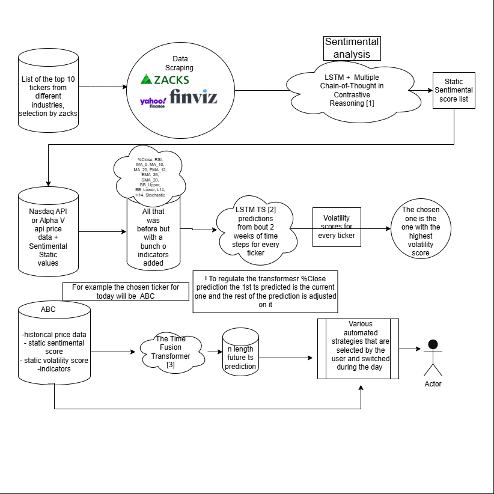

# ProfitPilot – Multi-Year Trading Bot Project

## Overview

ProfitPilot is a personal, long-term trading bot project I have been developing for three years, starting in high school. The project began as a collection of early versions and experiments.

---

## Project Intent

The primary goals of ProfitPilot are:

- research, implement, and test algorithmic trading strategies

- gather and process all the information needed in decision making, not having to rely on paid-for resources at all

- test different models in the environment, adjusting them so they perform optimally, compare them ,and choose based on complexity, speed, and accuracy, basic pros nd cons

- hopefully achieve total automation, although changing the degree of skepticism of the model, is the best I can do  

- build automation around market data ingestion, signal generation, and trade execution

- document the evolution of trading logic across multiple versions

- consolidate practical experience with finance, programming, and systems design

## Current project workflow:
<div style="background-color: #2D2D2D; padding: 10px;">
  
</div>

The papers mentioned are:

- [1]2503.07140v1.pdf  Application of Multiple Chain-of-Thought in Contrastive Reasoning for Implicit Sentiment Analysis

- [2]1703.10667v1.pdf  TS-LSTMandTemporal-Inception: Exploiting Spatiotemporal Dynamics for Activity Recognition

- [3]1912.09363v3.pdf Temporal Fusion Transformers for Interpretable Multi-horizon Time Series Forecasting (I know the abstract of this one 90% by heart) 

Although the papers studied for this project to achieve are a lot,for mostly nothing, you can find them in the ```/studies/all_studies

## Getting Started

1. Clone the repository:
   ```bash
   git clone https://github.com/Fips5/ProfitPilot.git
   cd ProfitPilot
2. Connect TWS to your needed IP and port
3. Go to main-1\utils\BuySell.py, line 91, the connect function, and put in the IP and ports shown in your TWS portal
4. Check that the api keys from main-1\utils\api_keys.json work using the api key checker tool
5. Run RUN.bat as administrator
6. Make sure all the channels are connected from your TWS settings
7. If it has any errors, make sure to download all the modules & libraries
7. Pray to god it works on your machine, if not, ask some questions nd give me some info
